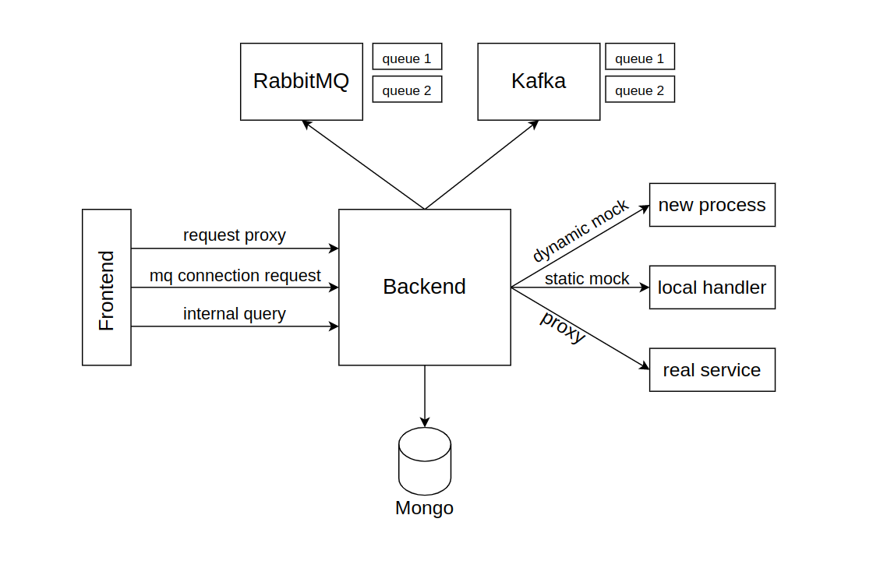

# Требования

По хорошему, Mock-Server в итоге должен уметь в 4 концепта:

- Проксировать HTTP запросы
- Создавать mock для REST-API
  - Возвращать константный ответ, по предикату
  - Запускать простой обработчик, например на Python, можно сделать примерно как в MapReduce, где пользователи описывают 1 функцию на Python, аргументом которой будет body HTTP запроса

- Создавать mock для очередей сообщений
  - Создавать новую очередь в брокере сообщений и начинать считывать все сообщения, пришедшие в эту очередь

- Связывать 2 очереди логикой преобразования ответов(ESB)
  - Создать воркера, который бы брал, все что прочли из IN очереди и, пропуская через mapper, отправлял ответ в очередь OUT


# Архитектура



## Frontend

Используем [React + Axios](https://www.digitalocean.com/community/tutorials/react-axios-react) для отрисовки сайта и вызова ручек бекенда, пример использования Axios:

```js
const user = {
    name: this.state.name
};

axios.post(`https://jsonplaceholder.typicode.com/users`, { user })
    .then(res => {
        console.log(res);
        console.log(res.data);
    }
)
```

Вроде как неплохой фреймворк для создания async web проксей, что нам тут и нужно

## Backend

### Общая часть

Backend полностью будет написан на языке Golang, в качестве основного web фреймворка будем использовать библиотеку [gin](https://github.com/gin-gonic/gin)

Запросы от фронтенда делятся на категории:

- `http://domain/ui/handle` UI запросы, которые в основном будут нужны, чтобы доставать информацию для рендера сайта, как например, список существующих REST моков.

- `http://domain/internal/handle` Внутренние запросы, необходимы, чтобы реализовывать логику по авторизации, аутентификации, созданию моков и тд.

- `http://domain/proxy/handle` Такие запросы просто будут проксироваться в backend, в основном это будут запросы к мокированным ручкам.

---

### База данных

В качестве базы данных, мы выбрали mongodb, так как в ней можно, без особых усилий, хранить raw данные, например формат JSON.

В процессе работы, придется хранить информацию о зарегистрированных пользователях, информацию о существующих мокированных маршрутах и прослушиваемых очередях, а также сообщения, прочитанные из очередей, для отрисовки в UI.

Будет как минимум 4 коллекции в Mongo:
- Users
- handles
- message_queues
- messages

---

### Работа с Брокерами сообщений | Чтение

Нужно в моменте слушать N очередей с разных брокеров, чтобы это выполнять эффективно, при старте сервера, заведем пул горутин, которые будут держать активные сессии с каждым из брокеров


Создадим канал, в котором будут распределяться очереди, после того как горутина захватила очередь для чтения, она перестраивает сессию с брокером, чтобы читать именно с этой очереди и начинает читать несколько секунд, после чего скидывет эту очередь опять в канал.

При таком подходе у нас фиксированное кол-во tcp соединений с брокерами, меняется лишь то, с каких очередей мы читаем.

### Работа с Брокерами сообщений | Запись

Чтобы писать в очереди, также как в предыдущем пункте создадим пул горутин и связывающий их канал, в который будут попадать задачи записи в определенную очередь.

---

### Rest mock

Хочется поддержать 2 вида мокирования Rest API:

- `Статический ответ` - На любое дергание ручки будем отдавать константый, заранее полученный, ответ

- `Динамический ответ` - При создании такого мока, пользователю необходимо будет написать программу на Python, где определить лишь 1 функцию `handler`, аргументом которой будет 2 dict-а - body и headers запроса

Чтобы поддержать Статический ответ, будем просто отдавать его в ответ на дергание ручки.

Чтобы поддержать Динамический ответ, будем оборачивать функцию пользователя в программу и запускать в отдельном процессе, чтобы гарантировать ограниченное окружение запуска.

---

### Proxy

Последнее, что нужно реализовать - проксирование запроса в реальный сервис, это позволит, при разработке частей системы тестировать их через mock, а после релиза переключать трафик на реальный сервис, тем самым облегчая процесс деплоя.

Чтобы реализовать нужно просто сделать 2 пайпа:

- User -> Real
- Real -> User

Каждую из этих пайп можно делать поднятием временной горутины, которая просто транслирует потоки друг в друга.
